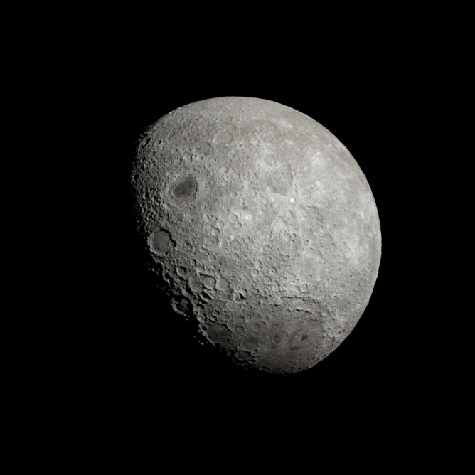

# Linkhub

This is a lightweight, easy to use single-page linkhub for your social media needs. It gives you a page where you can list all your important links, then just point your bio links to its URL. You can costumize it with your own colours, images, or anything else you might think of. It comes with extensive comments so people not too familiar with HTML/CSS can modify it as well. The project only uses HTML & CSS without any frameworks or Javascript involved. It should run on anything.

## Getting Started

Even though, I don't intend writing an extensive how-to about the installation of this package, here are a couple of instructions that might help. Otherwise, it's all basic web stuff.

### Prerequisites

You need your own webserver, it could be cloud-based, or shared hosting, doesn't really matter. The important thing is that you should have file uploading rights.

### Installing

Move all the files into a designated folder on your server. That's it.
Don't forget to costumize its style and content.

I'd also recommend creating a subdomain that points to that folder so it looks neat. Like this:
```
https://links.johnsmith.com
```

## Costumization

Here is how you can costumize this app.

### Changing the Title of your Page

Simply modify the `<title>The Moon | Links</title>` line in your `index.html` file to your liking.

### Changing your Profile Name

Change the text between the `h1` tags in the `index.html` file to modify your profile name.
```
<h1>@themoon</h1>
```

### Adding and Modifying Buttons

This is one of the most important part of the app. In your `index.html` file you will find the following lines:
```
<!-- PUT LINKS HERE -->
<li><a target="_blank" href="https://solarsystem.nasa.gov/moons/earths-moon/overview/">Learn About The Moon</a></li>
<li><a target="_blank" href="https://www.nasa.gov/mission_pages/apollo/index.html">NASA's Apollo Program</a></li>
<li><a target="_blank" href="https://www.nasa.gov/image-feature/image-of-a-supermoon">Supermoon</a></li>
<li><a target="_blank" href="https://www.nasa.gov/topics/moon-to-mars">Moon to Mars</a></li>
<li><a target="_blank" href="https://viktorfejes.com">viktorfejes.com</a></li>
<!-- END -->
```
You can modify, delete or add to these to create your own buttons. Adding is simply just duplicating one of these lines and then customizing that. Make sure to stay between the `HERE` and `END`.

### Adding and Modifying Social Links

In the `index.html` file you can add, delete or modify your social links similar to the buttons above. Find these lines, and customize away:
```
<!-- SOCIAL LINKS HERE -->
<li><a target="_blank" href="https://fb.com/viktorfejesretoucher" class="icon icon-facebook" title="Facebook"><span>Facebook</span></a></li>
<li><a target="_blank" href="mailto:viktor@viktorfejes.com" class="icon icon-email" title="Email"><span>Email</span></a></li>
<li><a target="_blank" href="https://instagram.com/vfejes" class="icon icon-instagram" title="Instagram"><span>Instagram</span></a></li>
<li><a target="_blank" href="https://twitter.com/vfejes" class="icon icon-twitter" title="Twitter"><span>Twitter</span></a></li>
<li><a target="_blank" href="https://youtube.com/c/ViktorFejes" class="icon icon-youtube" title="Youtube"><span>Youtube</span></a></li>
<li><a target="_blank" href="https://twitch.tv/viktorfejes" class="icon icon-twitch" title="Twitch"><span>Twitch</span></a></li>
<!-- END -->
```
Here is a list of the available social icons. You can always add your own if you know a bit of coding, but these are the default:
- Facebook
- Twitter
- Email
- Instagram
- Twitter
- Youtube
- Vimeo
- Pinterest
- Soundcloud
- Spotify
- Twitch
- LinkedIn
- Dribbble
- Behance

Use the service's name with the `icon-` prefix as a class. E.g. `icon-spotify`

### Colours and Theme

Open the `settings.css` file that you will find in the `css folder` in your favourite text editing application and customize all the variables under user settings. Then, simply save the file.

Let's say you'd want to make your buttons all black, you'd go and find the following line:
```
--button-background-color: #0B486B;
```
and change it to:
```
--button-background-color: #000000;
```
Don't forget that certain elements have two states (like buttons), a default and hover states. Default is how they would look without touching them, and hover is when you hover your mouse over them.

### Images

You can change two types of images in this app. One is your profile picture, the other is the background.

#### Changing your profile picture

Upload your profile picture in web-friendly format to the `images` folder, then change the corresponding lines of code in the `index.html` file.

Let's say, the name of your image is `buttercup.jpg`. Upload that to the `images` folder, then find the following line in `index.html`:
```

```
and change it to:
```

```

#### Adding a background image

Just like above, upload your image to the `images` folder. However, in this case you will open the `settings.css` file, and find the following line of code:
```
--background-image: url('../images/');
```
Here, you can insert the name of your file right after `images/`. Make sure that the single quotation mark follows your file name.

### Fonts

The project currently uses Google Fonts. You can change that by adding a different Google Font-Family in the header, and then referring to it in the `settings.css` file. Obviously, you can even use your own font.

## License

This project is licensed under the MIT License - see the [LICENSE.txt](LICENSE.txt) file for details